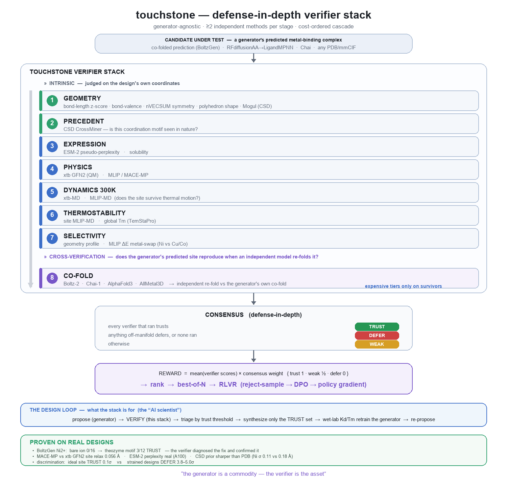

# touchstone

A generator-agnostic **verifier** for designed metal-binding proteins. The generator
(BoltzGen, RFdiffusionAA→LigandMPNN, Chai, …) proposes a metal-coordination site;
touchstone judges whether that *predicted* site is real enough to make — a trust/weak/defer
consensus that **by default runs four analytic geometry oracles** (defense-in-depth,
deterministic, no licence or GPU), with deep-physics, licensed, and cross-check tiers layered
on where their inputs are available:

- **default (anywhere)** — z-score vs the open **MetalPDB** metalloprotein prior · bond-valence sum ·
  nVECSUM enclosure · polyhedron-RMSD shape (à la CheckMyMetal) · open MetalPDB coordination-motif
  precedent. These form the consensus out of the box (no GPU, no licence); disable precedent with
  `--no-precedent`.
- **deep (GPU, `--deep`)** — MLIP (MACE · OrbMol · UMA): site relaxation + 300 K MD + preorganization
  (`trs`, metal-off reorganization); xtb GFN2.
- **metal selectivity** — pass a competitor panel (`--selectivity Ni2+,Cu2+,Co2+`):
  - **motif enrichment (no GPU, runs today).** Of all the sites a metal occupies in the PDB, what
    fraction use this donor set? Recovers HSAB by counting: N₂S₂ (His₂/Cys/Met) is most characteristic
    of Cu²⁺, all-oxygen O₆ of Mn²⁺ with Cu²⁺ last, Cys₄ of Fe. An *occupancy* prior — "does this look
    like a real Cu site?" — **not** a binding free energy.
    See [`docs/experiments/2026-07-14-selectivity-from-occupancy.md`](docs/experiments/2026-07-14-selectivity-from-occupancy.md).
  - **MLIP metal-swap ΔE — inert.** Gated on the Irving–Williams series, and every MLIP backbone fails
    it (neither MACE-MP nor OrbMol reproduces the series), so it `defer`s rather than emit a
    meaningless ranking. Thermodynamic metal ranking needs ligand-field physics (DFT with explicit
    spin states), not an MLIP — see
    [`docs/experiments/2026-07-13-mlip-cannot-rank-metals.md`](docs/experiments/2026-07-13-mlip-cannot-rank-metals.md).
- **opt-in** — independent co-fold (Boltz-2 / Chai-1 / AllMetal3D) · expression (ESM-2 ppl ·
  solubility) · thermostability (Tm); Mogul CSD validation (licensed). Reachable via providers /
  the `pipeline` / CLI flags, not in the default consensus.
- **experimental** — MetalHawk (learned ANN geometry class): confidently-OOD on de-novo designs,
  so demoted — the analytic polyhedron-RMSD tier is its replacement.



Use it to **triage designs to wet-lab** (only `trust` clears the bar) and to **score them
as an RLVR reward** to iterate the generator.

## Use in Claude Code

Install the plugin (bundles the MCP server + the `verify-metal-binder` skill + a
`/verify-binder` command):

```
/plugin marketplace add charleneleong-ai/ai4science
/plugin install touchstone@ai4science
```

Then `/verify-binder design.pdb Ni2+`, or just ask Claude to verify a design — it calls the
`verify_metal_binder` MCP tool. Requires [`uv`](https://docs.astral.sh/uv/) on PATH (the
plugin runs the server via `uv run`).

To register the MCP server directly instead of via the plugin:

```bash
uv tool install "touchstone[mcp] @ git+https://github.com/charleneleong-ai/ai4science.git#subdirectory=touchstone"
claude mcp add -s user touchstone -- touchstone-mcp
```

## CLI

```bash
touchstone verify design.pdb --metal Ni2+     # instant: geometry + bond-valence + CSD
touchstone rank designs/*.pdb --metal Ni2+    # batch, best-first by reward
touchstone verify design.pdb --deep           # + MLIP relax/MD (needs a GPU)
```

Compare a generator's own confidence with the verifier's verdict per design (BoltzGen iPTM/pLDDT/pTM vs touchstone consensus + the reason it deferred), optionally logging to W&B:

```bash
uv run --extra viz python scripts/boltzgen_scores.py \
  --npz-dir <fold_out_npz> --cif-dir <refold_cif> --metal Ni2+ --wandb
```

## Close the loop (RLVR)

The verdict doubles as a reward to fine-tune the generator on its own best designs
(reject-sampling / RAFT — BoltzGen ships no DPO). The loop is wired and validated end-to-end:

```bash
# 1. score a generated pool, keep the TRUST winners as the fine-tuning set
uv run python scripts/rlvr_select.py --npz-dir <fold_out_npz> --cif-dir <refold_cif> \
  --out round1 --metal Ni2+ --keep trust
# 2. convert the winners to BoltzGen training targets (bg env, on the GPU box)
python scripts/winners_to_targets.py --cif-dir round1/dataset --out targets/round1
# 3. resume-train BoltzGen on targets/round1 — then re-verify the next pool, repeat
```

CSD metal knowledge enters through the reward (touchstone's prior), **not** as raw training
data — the only sound way to inject small-molecule crystallography into a *protein* generator.
See [`docs/specs/2026-06-28-rlvr-boltzgen.md`](docs/specs/2026-06-28-rlvr-boltzgen.md).

**Result (Ni²⁺, 4 rounds).** The loop lifted the touchstone-TRUST rate **5.9% → 21.9%** (geometry),
and a *balanced* geometry∧MLIP reward reached **12.5% fully-verified** (passing all six tiers) — with
the honest catch that a single-objective reward trades one axis for the other, and that the balanced
gains then plateau. Full arc: [`docs/experiments/2026-07-01-rlvr-boltzgen-round1.md`](docs/experiments/2026-07-01-rlvr-boltzgen-round1.md).

## Sample output

Each result is a JSON-able dict: per-tier verdicts (`label` / `score` / `reason` + a
machine-readable `metrics` block), a `stack` listing every tier with its `status`
(`ran` / `skipped` / `needs_input`), and the trust/weak/defer `consensus`. A real
LigandMPNN Ni pack, verified **without a GPU** (the default, runs anywhere):

```jsonc
{
  "metal": "Ni2+", "coordination_number": 5, "donors": ["O","O","N","O","N"], "reference": "PDB",
  "verifiers": {
    "geometry":     { "label": "weak",  "score": 0.025, "reason": "strained geometry (2.3σ)",
                      "metrics": { "strain_sigma": 2.32, "cn": 5, "cn_modal": 4 } },
    "bond_valence": { "label": "defer", "score": 0.023, "reason": "BVS 0.90 vs formal 2 (Δ1.10) — defer",
                      "metrics": { "bvs": 0.9, "formal_valence": 2, "delta": 1.1 } }
  },
  "stack": [
    { "stage": "geometry",     "status": "ran" },
    { "stage": "bond_valence", "status": "ran" },
    { "stage": "mogul",        "status": "needs_input", "detail": "a CSD licence (Mogul / CSD Python API)" },
    { "stage": "mlip",         "status": "needs_input", "detail": "pass deep=True (needs a GPU backend)" },
    { "stage": "mlip_md",      "status": "needs_input", "detail": "pass deep=True (needs a GPU backend)" }
    // … cofold, expression, thermostability: needs_input
  ],
  "consensus": "defer"
}
```

With **`--deep`** on a GPU, the two MLIP tiers flip from `needs_input` to `ran` and add
quantitative physics (the rest of the result is identical):

```jsonc
"mlip":    { "label": "defer", "score": 0.088, "reason": "site lost 2 donor(s), drift 1.92 Å, ΔE_bind -3.33 eV — defer",
             "metrics": { "drift_angstrom": 1.92, "cn_before": 5, "cn_after": 3, "interaction_energy_ev": -3.327 } },
"mlip_md": { "label": "defer", "score": 0.059, "reason": "shell survived 6% of 300 K MD — defer",
             "metrics": { "retention": 0.059, "cn_initial": 5, "temperature_k": 300.0 } }
```

Here the GPU physics **confirms** the instant tiers' `defer`: under MACE relaxation the site
drifts ~2 Å and loses 2 of 5 donors, and only 6 % of the first shell survives 300 K MD.
Add `--stress` for a robustness map (`neutral` / `leachate` / `low_pH`) on top of either.

## Remote / deep tiers

The default tiers run anywhere. The deep tiers (MLIP/xtb/ESM) need a GPU, and CSD/Mogul
need a licence — host the server where those live and point clients at it over HTTP:

```bash
touchstone-mcp --http --host 0.0.0.0 --port 8000          # on the GPU box
claude mcp add --transport http touchstone http://<host>:8000/mcp   # on each client
```

## Scope

The trust threshold is grounded in metalloprotein geometry + physics, **not yet calibrated to
wet-lab outcomes** — `trust` means "physically / precedent-plausible," not a calibrated binding
probability. Tiers without their model/licence available report as `not_run` rather than guessing.

**Geometry is a weak filter, by construction.** The prior is calibrated so that a 2σ gate admits
~96% of *real* metalloprotein sites, which means it also admits most geometrically-plausible
designs. That is the tier's true resolution: discrimination is supposed to come from bond-valence,
the coordination tiers and MLIP, not from geometry alone. (The previous CSD prior looked far
sharper — because it was scoring protein sites against small-molecule crystals and rejecting 1 in 5
*real* Ni sites as off-manifold. See
[`docs/experiments/2026-07-13-geometry-prior-wrong-domain.md`](docs/experiments/2026-07-13-geometry-prior-wrong-domain.md).)

## Develop

```bash
uv sync --extra dev
uv run --extra dev pytest
```
